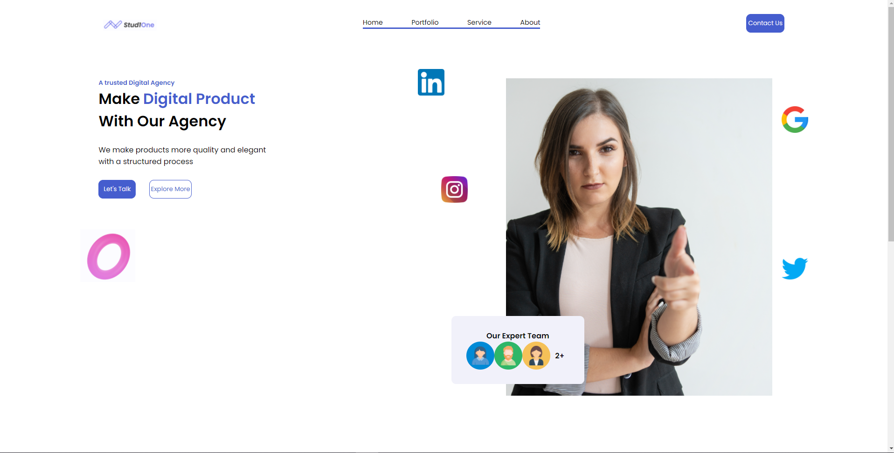
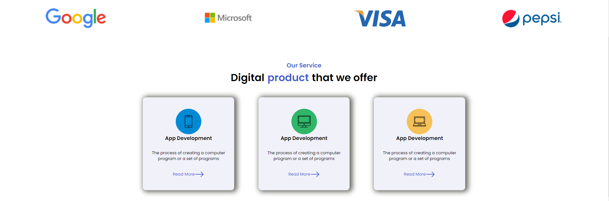

    <h1>Stand - One</h1>
    
Layout de um projeto publicado no dribble

     
    
Tela inicial do projeto

    
    

<h2 align="center">Layout concluído 🚀 </h2>

<h3 align="center">Tecnologias utilizadas</h3>
 

<strong>ReactJS</strong>
